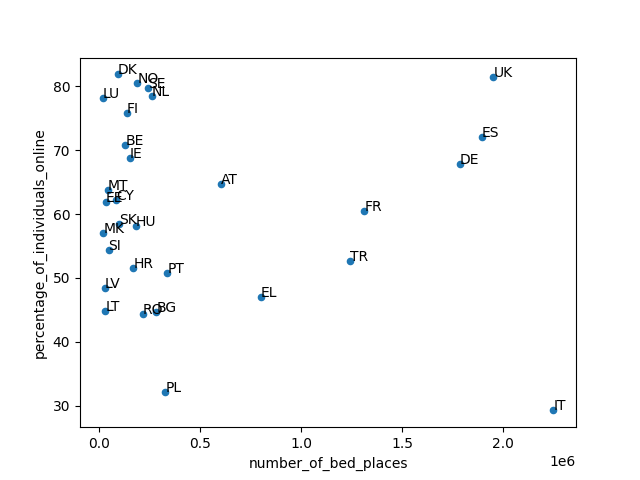

# How to run

```shell
python -m venv venv # tested to run at Python 3.10.6
source venv/bin/activate
pip install -r requirements.txt

# run the script to merge two CSV files
python manage.py merge_csvs.py

# 1. merged.csv will be created
# 2. plot will show up, which will basically be the same as Figure_1.png file in the folder.
```

# Plot



# Comment
- In `tour_cap_nat.tsv` file, `accommod` column seems to have changed into `accomunit` in the source dataset.
